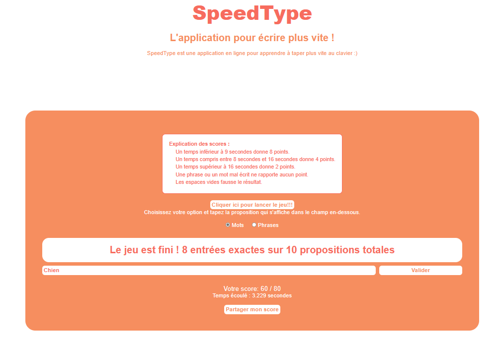

# AppJS-SpeedType

Ce dépôt GitHub contient un projet web en JavaScript pour améliorer la saisie au clavier, appelé "SpeedType". L'application permet à l'utilisateur de s'entraîner à taper rapidement en affichant des mots ou des phrases et en calculant le score en fonction du temps de saisie. Voici la structure de l'arborescence du projet :

```
AppJS SpeedType
├── .vscode
├── index.html
├── scripts
│   ├── config.js
│   ├── main.js
│   ├── popup.js
│   └── script.js
└── style
    └── style.css
```

##Image


## Contenu des fichiers

### index.html
Ce fichier contient la structure HTML de l'application SpeedType. Il inclut les fichiers CSS et JavaScript nécessaires pour le fonctionnement du jeu. Vous pouvez personnaliser le contenu de la page en modifiant ce fichier.

### style.css
Ce fichier CSS contient les styles utilisés pour la mise en forme de l'application SpeedType. Vous pouvez personnaliser l'apparence de l'application en modifiant ce fichier.

### scripts/config.js
Ce fichier JavaScript contient les constantes nécessaires au fonctionnement du jeu, notamment les listes de mots et de phrases proposées à l'utilisateur. Vous pouvez modifier ces listes ou ajouter de nouveaux mots/phrases pour enrichir le jeu.

### scripts/main.js
Ce fichier JavaScript est le point d'entrée de l'application. Il initialise le jeu et lance la boucle de jeu. Vous pouvez ajouter des fonctionnalités supplémentaires à l'application en modifiant ce fichier.

### scripts/popup.js
Ce fichier JavaScript contient les fonctions nécessaires à l'affichage et à la fermeture de la popup de partage. Vous pouvez personnaliser le comportement de la popup en modifiant ce fichier.

### scripts/script.js
Ce fichier JavaScript contient diverses fonctions utilisées par l'application, notamment pour la validation des données saisies par l'utilisateur, l'affichage des résultats et la gestion des événements. Vous pouvez ajouter des fonctionnalités supplémentaires en modifiant ce fichier.

## Utilisation
1. Ouvrez le fichier `index.html` dans un navigateur web pour accéder à l'application SpeedType.
2. Lorsque vous êtes prêt à commencer, cliquez sur le bouton "Lancer le jeu".
3. Choisissez votre option (mots ou phrases) en utilisant les boutons radio.
4. La zone de proposition affichera un mot ou une phrase à taper.
5. Saisissez le mot ou la phrase dans la zone de saisie et appuyez sur "Entrée" ou cliquez sur le bouton "Valider".
6. Le score sera mis à jour en fonction de votre temps de saisie et des règles définies.
7. Répétez les étapes 5 et 6 pour chaque proposition affichée.
8. Une fois que toutes les propositions ont été traitées, le jeu affichera le score total.
9. Vous pouvez partager votre score en cliquant sur le bouton "Partager mon score" et en remplissant le formulaire de la popup.

## Remarque
Ce projet est destiné à améliorer la saisie au clavier et est fourni à des fins éducatives. Toute contribution et amélioration sont les bienvenues.

## Auteur
- **Nom**: SONON
- **Prénom**: Charbel
- **Github**: [github.com/AsKing07](https://github.com/AsKing07/)

---

*Veuillez noter que ce README fournit des informations sur l'arborescence et le contenu des fichiers du projet. Pour accéder au code source complet, veuillez consulter le dépôt GitHub à l'adresse suivante: [github.com/AsKing07/AppJS-SpeedType](https://github.com/AsKing07/AppJS-SpeedType)*
